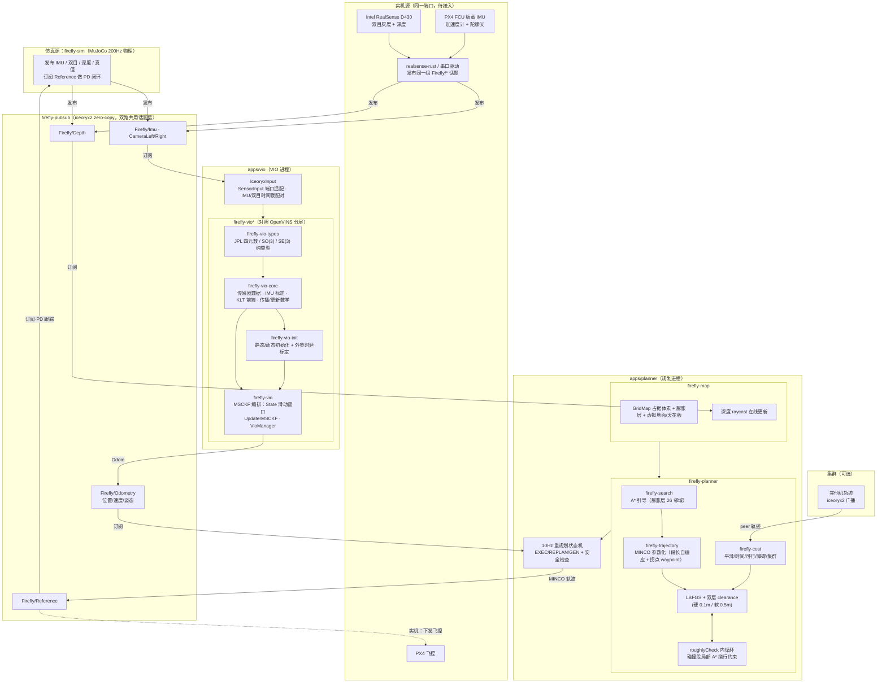
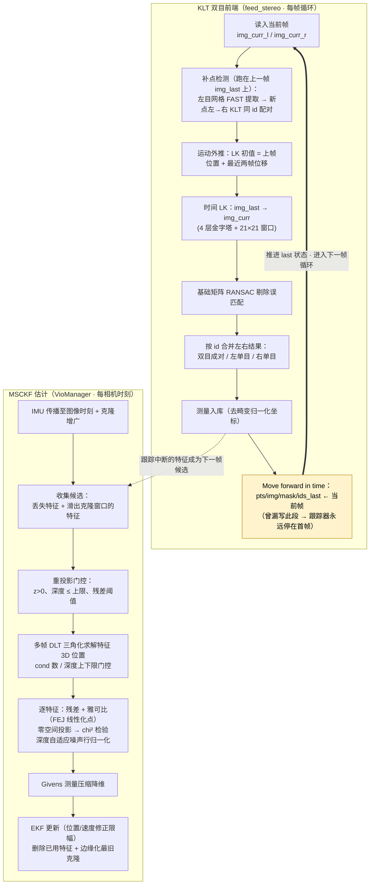

# firefly 自主无人机系统架构

```mermaid
flowchart TD
    subgraph SIM_SRC["仿真源：firefly-sim（MuJoCo 200Hz 物理）"]
        SIMP["发布 IMU / 双目 / 深度 / 真值<br/>订阅 Reference 做 PD 闭环"]
    end

    subgraph HW_SRC["实机源（同一端口，待接入）"]
        CAM["Intel RealSense D430<br/>双目灰度 + 深度"]
        IMU_SENSOR["PX4 FCU 板载 IMU<br/>加速度计 + 陀螺仪"]
        FC["PX4 飞控"]
        DRV["realsense-rust / 串口驱动<br/>发布同一组 Firefly/* 话题"]
        CAM --> DRV
        IMU_SENSOR --> DRV
    end

    subgraph PUBSUB["firefly-pubsub（iceoryx2 zero-copy，双路共用话题层）"]
        TOPIC_SENS["Firefly/Imu · CameraLeft/Right"]
        TOPIC_DEPTH["Firefly/Depth"]
        TOPIC_ODOM["Firefly/Odometry<br/>位置/速度/姿态"]
        TOPIC_REF["Firefly/Reference"]
    end

    SIMP -->|发布| TOPIC_SENS
    SIMP -->|发布| TOPIC_DEPTH
    DRV -->|发布| TOPIC_SENS
    DRV -->|发布| TOPIC_DEPTH

    subgraph VIO_APP["apps/vio（VIO 进程）"]
        INPUT["IceoryxInput<br/>SensorInput 端口适配 · IMU/双目时间戳配对"]
        subgraph VIO["firefly-vio*（对照 OpenVINS 分层）"]
            TYPES["firefly-vio-types<br/>JPL 四元数 / SO(3) / SE(3) 纯类型"]
            CORE["firefly-vio-core<br/>传感器数据 · IMU 标定 · KLT 前端 · 传播/更新数学"]
            INIT["firefly-vio-init<br/>静态/动态初始化 + 外参时延标定"]
            MSCKF["firefly-vio<br/>MSCKF 编排：State 滑动窗口<br/>UpdaterMSCKF · VioManager"]
            TYPES --> CORE
            CORE --> INIT
            CORE --> MSCKF
            INIT --> MSCKF
        end
        INPUT --> VIO
    end

    TOPIC_SENS -->|订阅| INPUT

    subgraph PLAN_APP["apps/planner（规划进程）"]
        subgraph MAP["firefly-map"]
            GRID["GridMap 占据体素 + 膨胀层 + 虚拟地面/天花板"]
            RAY["深度 raycast 在线更新"]
        end
        subgraph PLAN["firefly-planner"]
            ASTAR["firefly-search<br/>A* 引导（膨胀层 26 邻域）"]
            MINCO["firefly-trajectory<br/>MINCO 参数化（段长自适应 + 拐点 waypoint）"]
            OPT["LBFGS + 双层 clearance<br/>(硬 0.1m / 软 0.5m)"]
            ROUGH["roughlyCheck 内循环<br/>碰撞段局部 A* 绕行约束"]
            COST["firefly-cost<br/>平滑/时间/可行/障碍/集群"]
            ASTAR --> MINCO --> OPT
            COST --> OPT
            OPT <--> ROUGH
        end
        FSM["10Hz 重规划状态机<br/>EXEC/REPLAN/GEN + 安全检查"]
        MAP --> PLAN
        PLAN --> FSM
    end

    subgraph SWARM["集群（可选）"]
        PEER["其他机轨迹<br/>iceoryx2 广播"]
    end

    MSCKF -->|Odom| TOPIC_ODOM
    TOPIC_ODOM -->|订阅| FSM
    TOPIC_DEPTH -->|订阅| RAY
    PEER -->|peer 轨迹| COST
    FSM -->|MINCO 轨迹| TOPIC_REF
    TOPIC_REF -->|订阅·PD 跟踪| SIMP
    TOPIC_REF -.->|实机：下发飞控| FC
```

## VIO 单帧算法流程

```mermaid
flowchart TD
    subgraph FRONTEND["KLT 双目前端（feed_stereo · 每帧循环）"]
        PRE["读入当前帧<br/>img_curr_l / img_curr_r"]
        DETECT["补点检测（跑在上一帧 img_last 上）：<br/>左目网格 FAST 提取 → 新点左→右 KLT 同 id 配对"]
        EXTRAP["运动外推：LK 初值 = 上帧位置 + 最近两帧位移"]
        TLK["时间 LK：img_last → img_curr<br/>(4 层金字塔 + 21×21 窗口)"]
        RANSAC["基础矩阵 RANSAC 剔除误匹配"]
        PAIR["按 id 合并左右结果：<br/>双目成对 / 左单目 / 右单目"]
        DB["测量入库（去畸变归一化坐标）"]
        ADVANCE["Move forward in time：<br/>pts/img/mask/ids_last ← 当前帧<br/>（曾漏写此段 → 跟踪器永远停在首帧）"]
        PRE --> DETECT --> EXTRAP --> TLK --> RANSAC --> PAIR --> DB --> ADVANCE
    end

    subgraph MSCKF["MSCKF 估计（VioManager · 每相机时刻）"]
        PROPAG["IMU 传播至图像时刻 + 克隆增广"]
        COLLECT["收集候选：<br/>丢失特征 + 滑出克隆窗口的特征"]
        RGATE["重投影门控：<br/>z>0、深度 ≤ 上限、残差阈值"]
        TRIANG["多帧 DLT 三角化求解特征 3D 位置<br/>cond 数 / 深度上下限门控"]
        JRES["逐特征：残差 + 雅可比（FEJ 线性化点）<br/>零空间投影 → chi² 检验<br/>深度自适应噪声行归一化"]
        COMPRESS["Givens 测量压缩降维"]
        UPDATE["EKF 更新（位置/速度修正限幅）<br/>删除已用特征 + 边缘化最旧克隆"]
        PROPAG --> COLLECT --> RGATE --> TRIANG --> JRES --> COMPRESS --> UPDATE
    end

    DB -.->|"跟踪中断的特征成为下一帧候选"| COLLECT
    ADVANCE ==>|"推进 last 状态 · 进入下一帧循环"| PRE

    classDef critical fill:#fff3cd,stroke:#b8860b,color:#000;
    class ADVANCE critical;
```
