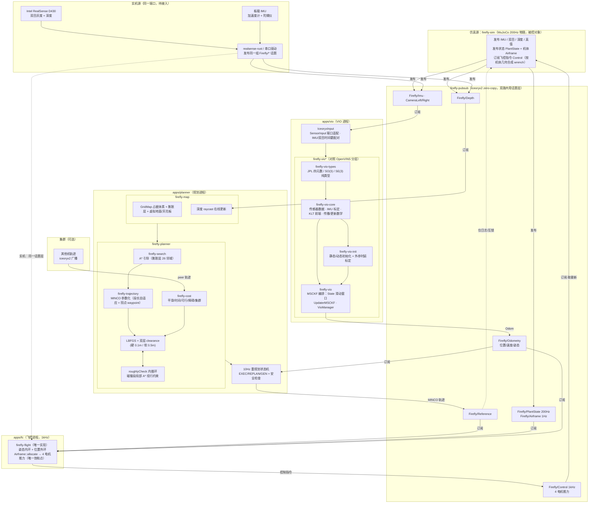
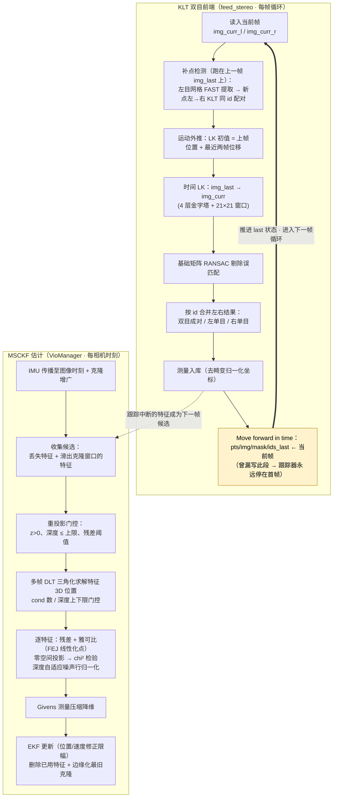

# firefly 自主无人机系统架构



## 控制链（`firefly-flight` + `apps/fc`）

推力只能沿机体 `+Z`（4 旋翼共同作用）：滚转/俯仰力矩来自推力差，偏航力矩来自
旋翼反扭矩，水平加速必须靠倾斜——四旋翼与“世界系全驱动扳手”模型的根本区别。

```
参考（Firefly/Reference）
  → position_mode/angle_mode（期望力/力矩，不限幅）
  → Airframe::allocate（逐电机限幅，全栈唯一饱和点）→ 4 电机推力
  → Firefly/Control（1kHz，被控对象每步取最新）
  → 被控对象按机体几何合成 wrench（Firefly/Airframe 给的唯一一份几何）
```

- **参数归属**：质量/惯量/气动阻尼/旋翼位置/旋向/单电机推力上限/反扭矩系数
  由被控对象经 `Firefly/Airframe` 发布（1Hz 电平，改几何不动飞控）；
  增益/倾角限幅在 `configs/fc.toml`（缺键回落 `firefly-flight` 默认值）。
- **反馈分工**：内环姿态由飞控自估（陀螺积分 + 加速度计水平修正，航向取
  `Firefly/Odometry` 的姿态，JPL `q_GtoI` 的换算见 `apps/fc/src/vio.rs` 与其单测）；
  位置/速度取 VIO 估计，未到达时回落 `PlantState` 真值（起飞前正常）。
- **节拍**：控制律无积分项，dt 不进控制；被控对象状态陈旧（>50ms）时飞控
  **不发指令**，由被控对象悬停兜底（失效保护，不是第二套跟踪律）。
- **待观测**：侧向漂移的量化只在闭环实测（`fc/debug/*` 进 rrd：推力/倾角/
  姿态误差/tick 率/晚到/饱和）。当前闭环仍受 VIO 估计限制：悬停时估计自漂
  ~0.4m/s（`--script` 路径同现象，与飞控无关），被控对象会跟随估计漂移；
  用真值反馈的 FC 闭环已实测悬停稳态（推力恒 = mg、倾角 <0.1°、tick 1kHz）。

## VIO 单帧算法流程


