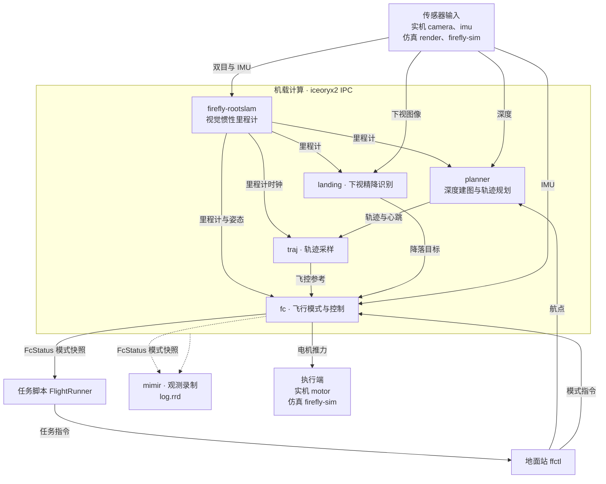

# Firefly 系统架构

```mermaid
flowchart TB
    sensors["`传感器输入
实机 camera、imu
仿真 render、firefly-sim`"]
    operator["地面站 ffctl"]
    task["任务脚本 FlightRunner"]

    subgraph flight["机载计算 · iceoryx2 IPC"]
        vio["`firefly-rootslam
视觉惯性里程计`"]
        landing["landing · 下视精降识别"]
        planner["`planner
深度建图与轨迹规划`"]
        traj["traj · 轨迹采样"]
        fc["fc · 飞行模式与控制"]

        vio -->|里程计| planner
        vio -->|里程计| landing
        vio -->|里程计时钟| traj
        vio -->|里程计与姿态| fc
        planner -->|轨迹与心跳| traj
        traj -->|飞控参考| fc
        landing -->|降落目标| fc
    end

    sensors -->|双目与 IMU| vio
    sensors -->|深度| planner
    sensors -->|下视图像| landing
    sensors -->|IMU| fc
    operator -->|航点| planner
    task -->|任务指令| operator
    fc -->|FcStatus 模式快照| task
    fc -.->|FcStatus 模式快照| mimir
    operator -->|模式指令| fc
    fc -->|电机推力| actuators["`执行端
实机 motor
仿真 firefly-sim`"]
    flight -.-> mimir["`mimir · 观测录制
log.rrd`"]
```

`planner`、`traj` 和 `landing` 各自在进程内通过 `firefly-odometry` 接收并校验里程计。
`landing` 按图像时间查询历史样本，`traj` 按样本时间采样轨迹，`planner` 将实测位置和速度转换为规划初态，并为这个起点指定零加速度。
