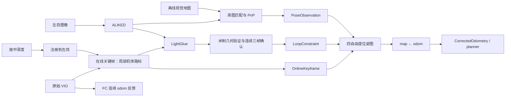

# 在线 RGB-D 回环与地图定位

## 数据流



离线库图定位产生绝对地图观测；在线回环比较当前图像与本次运行采集的历史图像，
产生历史机体到当前机体的相对约束。它们是不同证据，不互相替代。

## 深度几何

图像原点在左上，相机坐标为右、上、后，轴向深度为正数：

```
p_depth = [(u-cx) z/f, -(v-cy) z/f, -z]
p_left = T_left_depth p_depth
u_left = cx - f x_left/z_left
v_left = cy + f y_left/z_left
```

使用 `RigidTransform` 的标定外参，不把欧氏距离当作轴向深度。
点投到最近的左目像素，多个点竞争时保留最近表面；不填充空洞。
亚像素特征需要四邻点有效，且深度差不超过 `max(0.03m, 2% × 最近深度)`，
才能双线性插值。该保守策略会丢弃边缘特征；点重投影有最多半像素量化误差，
不承诺恢复深度相机没有看到的表面。离线建库与在线关键帧共用同一实现。
重新建库必须重新生成 `.manifest.json`，其构建器 hash 关联注册算法。

## 在线候选与验证

- 独立传感器接收线程保留 15 秒 odom、12 秒深度。特征与深度时间戳必须相同；
  odom 只内插，不外推，两个端点间隔不得超过 100 ms。VIO 失去初始化后锁存停用。
- 默认每秒最多一个关键帧，至少 30 个有效 RGB-D 路标；路标保存在该帧机体系，
  原始 VIO 位姿不能被图优化覆盖。
- 归一化描述子均值用于外观短名单，默认取前三名；候选至少早 15 秒，累计运动
  至少 2 米。不使用地图位置来检索在线回环，近期邻居被排除。
- LightGlue 建立特征对应；三维路标做 256 次上限的确定性三点 RANSAC，
  共识 SVD 估计固定尺度刚体变换。它使用已有视觉对应，不进行点云最近邻搜索。
- 刚体解作为 PnP 初值；必须满足相对 VIO 初值的 3m / 15° 门限。
  最终要求至少 30 个内点、40% 支持、3px 重投影、10cm 三维一致性，覆盖
  4×3 图像网格中的至少四格。三维阈值由 `configs/lightglue.toml` 的
  `depth_error` 指定，默认 0.1m，运行前固定。
- 多候选解冲突时拒绝；连续三次检测的 odom 侧修正需在 30cm / 5° 内一致，
  间隔不得超过 3 秒。任一次缺数据/无解重置确认；发布后至少冷却 5 秒。
- 后端独立检查质量、时间、端点、重复边、四元数、3m / 30° 新息与 5° 重力一致性。
  超过接收历史时间范围的消息不续期，不从 GroundTruth 获得任何约束。

均值描述子是轻量候选检索方法，不是经过地点识别训练的全局描述子；重复纹理、
视角大变化、照明变化可能导致拒绝。固定启动先验与离线地图查询半径仍然存在。
这条链路不承诺任意位置启动或大幅绑架恢复。

## 图优化的数学定义

节点 `x_i = (p_i, ψ_i)`：地图位置与航向，滚转/俯仰固定为 VIO 重力估计。
首节点使用显式固定启动先验并固定。VIO 相对边只连接相邻节点。
同一运动区间的跨节点差分共享测量，不能作为额外独立证据重复计权。

```
R_i = Rz(ψ_i) R_tilt_i
r_ij = [R_iᵀ (p_j-p_i) - t_ij,
        wrap(ψ_j-ψ_i-Δψ_ij)]
r_map = [p_i-p_observed, wrap(ψ_i-ψ_observed)]
```

残差按米/弧度的标准差白化。VIO 边用二次代价；回环与地图锚点用 Huber 核。
配置 `GraphOptions` 给出 VIO 扩散密度 0.1m/√s / 0.05rad/√s，
相邻间隔 Δt 的标准差为密度 × √Δt；地图标准差 0.1m / 0.05rad，
回环 0.05m / 0.03rad，Huber 转折 2.5。它们是工程噪声模型，没有宣称统计校准；
图不传播完整 VIO 协方差，相关视觉信息也没有完整去相关。
一维平移的累计方差与关键帧分段数量无关，测试同时检查解析融合结果与梯度差分。

解析雅可比组装稀疏四维块正规方程，块 Jacobi 预条件 PCG 求增量，回溯要求目标下降。
优化局部副本后一次提交；线性求解失败不发布部分解。最后节点给出：

```
R_map_odom = Rz(ψ_optimized - ψ_raw)
t_map_odom = p_optimized - R_map_odom p_raw
```

输出仅改变 map←odom，原始 VIO 和 FC odom 锚点保持连续。规划器和地图参考使用
校正状态；地图校正仍可能令地图参考在 odom 中变化，不能把反馈连续等同于瞬时无控制扰动。
`backend = "eskf"` 使用独立滤波模式，不接收回环图校正，不与图后端重复融合。

## 容量、会话和证据

在线关键帧与位姿图各默认最多 512 节点；图还包含地图观测时刻，因此可能先满。
容量耗尽明确拒绝新节点，保留已建立的地图对齐和已有节点约束；不宣称无限航程。
没有跨会话序列合并、持久化图恢复、全局束调整或在线更新静态规划地图。
重启 VIO 后必须连同定位与视觉进程在固定起点重启。

RRD 实体：

| 实体 | 分量 |
|---|---|
| `loop/debug/frontend` | 关键帧数、候选数、几何内点数、连续确认数 |
| `corr/debug/loops` | 接受回环累计数、图节点数、本次是否接受 |
| `corr/debug/gate` | 图模式：重投影像素误差、3px 门限、注入平移米、本次地图锚点是否接受 |
| `logs/lightglue` / `logs/localization` | 拒收、容量、同步和优化诊断 |

`real_model_revisit_contract` 使用真实 RMUC 图像特征、深度和 ONNX 模型，对同一图像
模拟离开再重访，验证三次确认、回环消息和漂移下降。这是集成契约，不是跨视角飞行
成功率。普通自动任务报告也不把地图观测接受次数计为在线回环成功。

## 参考源码与实现边界

- VINS-Fusion `be55a937a57436548ddfb1bd324bc1e9a9e828e0`：
  `loop_fusion/src/pose_graph.h::FourDOFError`、`pose_graph.cpp::optimize4DoF`。
  对照局部平移残差、四邻边、固定首节点、鲁棒回环与航向漂移输出。上游角度为度，
  本实现统一使用弧度并显式设置权重；线性求解器使用自有 PCG，非 Ceres。
- ORB-SLAM3 `4452a3c4ab75b1cde34e5505a36ec3f9edcdc4c4`：
  `src/LoopClosing.cc::NewDetectCommonRegions` 与 `DetectCommonRegionsFromBoW`，
  `src/Sim3Solver.cc::ComputeSim3`。对照近期邻居排除、几何共识、固定尺度和连续确认。
  本实现使用 ALIKED/LightGlue、RGB-D、SVD；不包含 ORB/DBoW、Atlas 或全局 BA。

两个参考项目为 GPLv3；本仓库代码根据几何公式和流程独立实现，没有引入其源码文件、
词袋库、实现片段或权重。下载的参考仓库保留在 `~/Projects/`，不纳入本仓库。

## 任务跟踪质量

`Firefly/LocalizationStatus` 与 `CorrectedOdometry` 分开：地图查询需要坐标已对齐的
先验，而飞行跟踪还要求新鲜且一致的独立地图观测。`configs/localization.toml`
的 `[quality]` 缺省要求视觉测量年龄 ≤3s、融合后与同刻视觉观测的位置分歧 ≤0.5m。
这是任务误差预算，不是统计置信界或避碰保证；重复消息不能续期。

planner 同时检查两条流，500ms 墙钟失联或已就绪后的质量退化锁存停止参考发布，
恢复需要重启 planner。FC 保持连续 odom 反馈，参考超时转 Hold；不能把这一行为
称为独立于 VIO 的定点保证。原始证据为 `corr/debug/tracking_quality`
（视觉年龄、位置分歧、可跟踪标志）和 `vision/debug/map_query_wall_s`。

库图定位使用两条 ORT 算子线程，在线回环使用独立会话和一条算子线程；
回环输入零容量交接，忙时丢帧，结果队列容量为一。退出会取消候选搜索并等待线程结束。
地图候选最多三帧；提前结束要求至少 30 个三维匹配、点协方差最小特征值
大于 0.0025m² 且最小/最大特征值比大于 0.01，再通过 PnP 内点和重投影门控。
平面或弱匹配继续聚合候选，不承诺固定推理时延。

图像时刻 t 的查询先验为 `T_map_body(s) T_odom_body(s)^-1 T_odom_body(t)`，
其中 s 是地图里程计测量时刻。两个原始 VIO 位姿必须由历史覆盖，不允许以当前航向
给旧图像做候选或 PnP 几何门控。同刻图节点由首个原始位姿固定，异步地图与回环
观测复用这一快照，不覆盖历史。ALIKED 单线程最多 5Hz，忙时只取最新帧。
